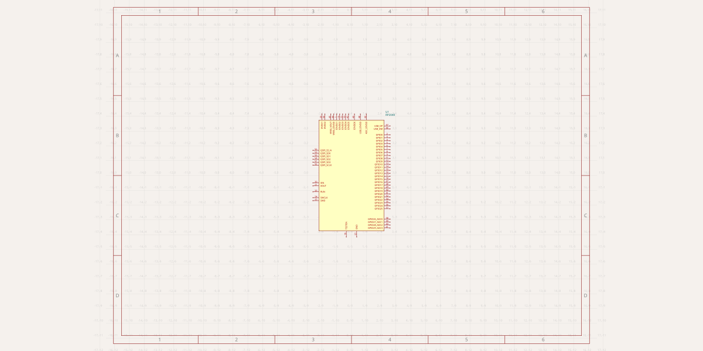
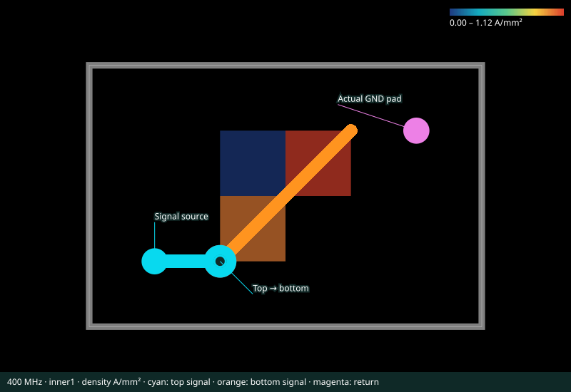
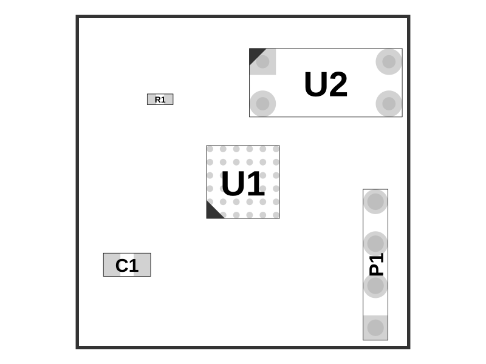
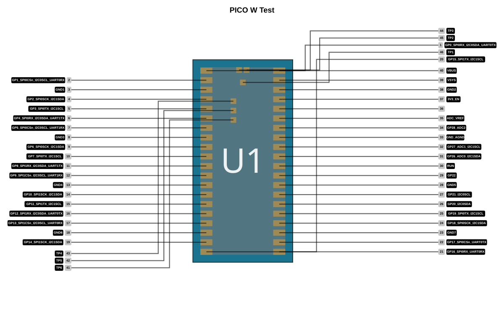
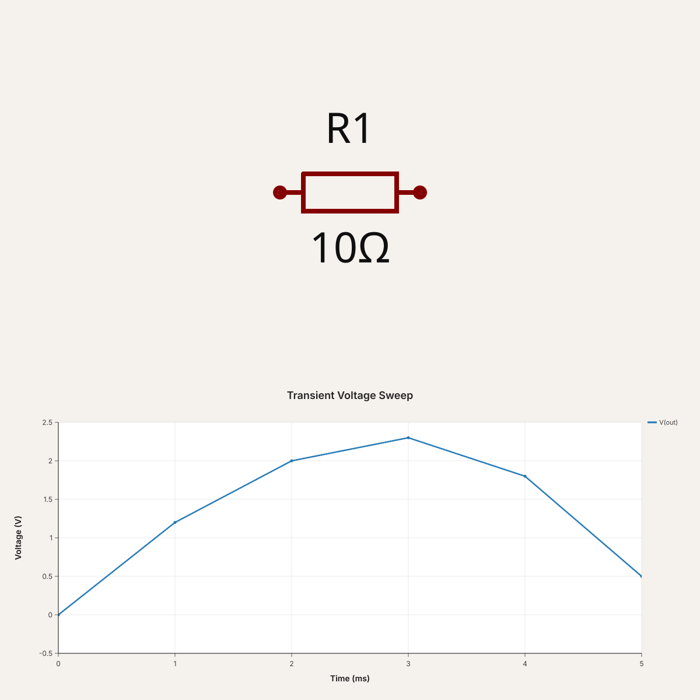
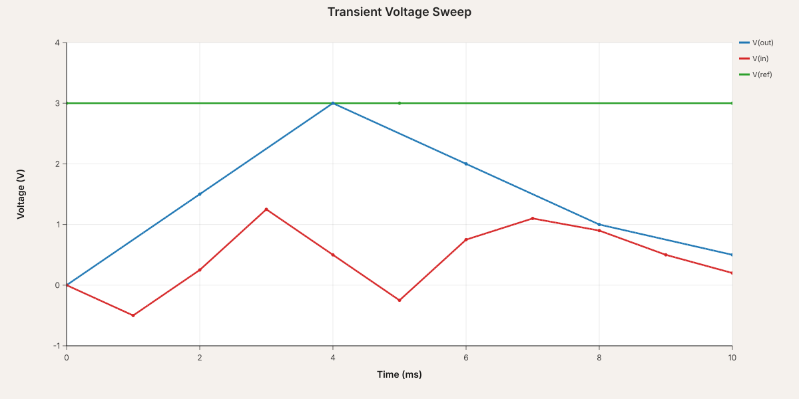
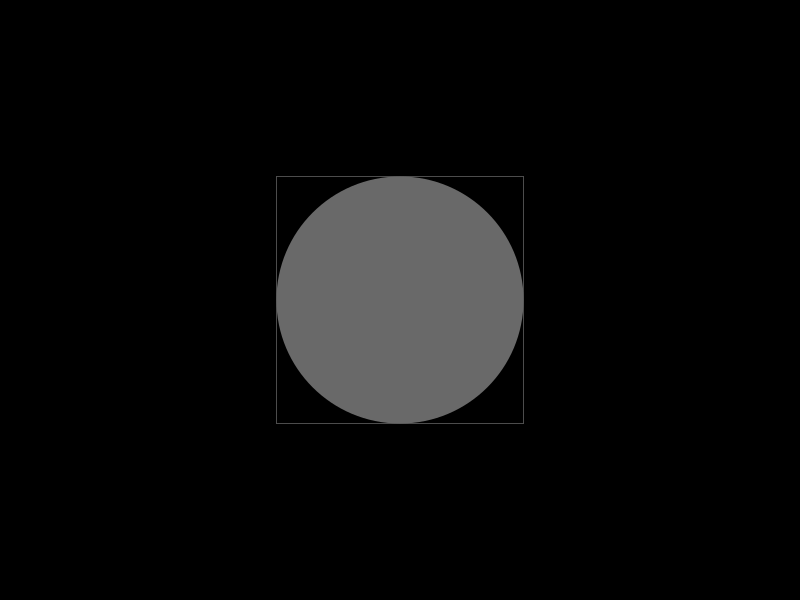

# circuit-to-svg

A TypeScript library for converting Circuit JSON to Schematic, PCB and Assembly SVG representations.

[Getting Started Contributor Video](https://share.cleanshot.com/6zXbLGF7)

<div align="center">
  
  
</div>

```bash
npm add circuit-to-svg
# or...
bun add circuit-to-svg
```

## Overview

This library provides functionality to convert Circuit JSON into SVG (Scalable Vector Graphics) representations. It supports both schematic and PCB (Printed Circuit Board), and Assembly layouts.

## Installation

```bash
npm install circuit-to-svg
```

## Usage

```typescript
import { readFileSync, writeFileSync } from 'fs'
import { convertCircuitJsonToSchematicSvg } from 'circuit-to-svg'

const circuitJson = JSON.parse(readFileSync('circuit.json', 'utf8'))
const schematicSvg = convertCircuitJsonToSchematicSvg(circuitJson)

writeFileSync('schematic.svg', schematicSvg)
```

Explore the API sections below to render PCB, assembly, pinout, simulation, and solder paste views.

| Function | Description |
| --- | --- |
| [`convertCircuitJsonToSchematicSvg`](#convertcircuitjsontoschematicsvg) | Generate schematic SVG output from Circuit JSON. |
| [`convertCircuitJsonToSchematicSimulationSvg`](#convertcircuitjsontoschematicsimulationsvg) | Overlay simulation data on schematic diagrams. |
| [`convertCircuitJsonToPcbSvg`](#convertcircuitjsontopcbsvg) | Render PCB layouts as SVG graphics. |
| [`convertCircuitJsonToSolderPasteMask`](#convertcircuitjsontosolderpastemask) | Create solder paste mask layers for fabrication. |
| [`convertCircuitJsonToAssemblySvg`](#convertcircuitjsontoassemblysvg) | Produce assembly view SVGs for board visualization. |
| [`convertCircuitJsonToPinoutSvg`](#convertcircuitjsontopinoutsvg) | Build annotated pinout diagrams for boards and modules. |
| [`convertCircuitJsonToSimulationGraphSvg`](#convertcircuitjsontosimulationgraphsvg) | Plot simulation experiment results as SVG graphs. |

## API

## convertCircuitJsonToSchematicSvg

`convertCircuitJsonToSchematicSvg(circuitJson: AnyCircuitElement[], options?): string`

Converts a schematic circuit description to an SVG string.

```typescript
import { convertCircuitJsonToSchematicSvg } from 'circuit-to-svg'

const schematicSvg = convertCircuitJsonToSchematicSvg(circuitJson, {
  includeVersion: true,
})
```



### Options

- `width` and `height` – dimensions of the output SVG. Defaults to `1200x600`.
- `grid` – enable a schematic grid (`true`) or configure cell size and labels.
- `labeledPoints` – annotate specific coordinates with helper labels.
- `colorOverrides` – override portions of the schematic color palette.
- `className` – add one or more extra classes to the root schematic `<svg>`.
- `css` – append custom CSS to the generated schematic SVG.
- `includeVersion` – if `true`, add a `data-circuit-to-svg-version` attribute to
  the root `<svg>`.
- `shouldDrawErrors` – draw pin highlights and a local message callout for
  `source_component_misconfigured_error`, `source_pin_must_be_connected_error`,
  `source_i2c_misconfigured_error`, and `source_trace_not_connected_error`
  elements that reference source ports. Only pins on the selected schematic
  sheet are highlighted; one message is displayed per error.
- `showErrorsInTextOverlay` – display error messages at the top of the SVG.
  This optional overview is independent of the local `shouldDrawErrors`
  callouts.

## convertCircuitJsonToPcbSvg

`convertCircuitJsonToPcbSvg(circuitJson: AnyCircuitElement[], options?): string`

Converts a PCB layout description to an SVG string.

```typescript
import { convertCircuitJsonToPcbSvg } from 'circuit-to-svg'

const pcbSvg = convertCircuitJsonToPcbSvg(circuitJson, {
  matchBoardAspectRatio: true,
  backgroundColor: '#1e1e1e',
  showPinNumbers: true,
})
```


### Options

- `width` and `height` – dimensions of the output SVG. Defaults to `800x600`.
- `matchBoardAspectRatio` – if `true`, adjust the SVG dimensions so the
  resulting aspect ratio matches the `pcb_board` found in the circuit JSON.
- `backgroundColor` – fill color for the SVG background rectangle. Defaults to
  `"#000"`.
- `drawPaddingOutsideBoard` – if `false`, omit the board outline and extra
  padding around it. Defaults to `true`.
- `showPcbNotes` – if `false`, hide all `pcb_note*` overlay primitives at render
  time. Defaults to `true`.
- `showFabricationNotes` – if `false`, omit all `pcb_fabrication_note_*`
  annotations from rendering and bounds. Defaults to `true`.
- `showPinNumbers` – if `true`, annotate PCB pads with small gray pin numbers.
  Defaults to `false`.
- `showSolderPaste` – if `true`, render `pcb_solder_paste` primitives. Defaults
  to `false`.
- `shouldDrawErrors` – if `true`, display visual error indicators (red diamonds with text) for error elements in the circuit JSON. Supports:
  - `pcb_trace_error` – errors related to PCB traces
  - `pcb_footprint_overlap_error` – errors for overlapping pads, plated holes, and holes (displays error indicators at each affected element with connecting lines)
  - `pcb_pad_trace_clearance_error` – clearance errors between pads and traces
  - `pcb_via_trace_clearance_error` – clearance errors between vias and traces
  
  Defaults to `false`.
- `shouldDrawWarnings` – if `true`, display yellow component highlights and
  warning messages for supported warning elements in the circuit JSON. Supports
  `pcb_connector_not_in_accessible_orientation_warning` and
  `pcb_manual_edit_conflict_warning`. Defaults to `false`.
- `includeVersion` – if `true`, add a `data-circuit-to-svg-version` attribute to
  the root `<svg>`.

## PCB return-current simulation overlays

Pass `simulationResultId` to render one completed
`simulation_pcb_return_current_result` alongside the actual PCB. Other simulation
results remain hidden. The selected excitation traces appear in cyan on top and
orange on bottom; referenced signal/return pads and vias retain their actual PCB
positions. Return contacts are magenta. Ordinary PCB rendering remains unchanged
when this option is omitted.

```typescript
import { convertCircuitJsonToPcbSimulationSvg } from 'circuit-to-svg'

const svg = await convertCircuitJsonToPcbSimulationSvg(circuitJson, {
  simulationResultId: 'simulation_pcb_return_current_result_0',
  layer: 'inner1',
  returnCurrent: { opacity: 0.65, showVectors: true, phaseDegrees: 0 },
})
```

The asynchronous API loads embedded plain JSON or gzip field Assets, validates
decoded arrays with the official Circuit JSON schema, and then calls
`convertCircuitJsonToPcbSvg`. Supply `resolveAsset(asset)` to read external assets
explicitly; the library never performs network or filesystem requests itself.
Only the selected result/layer's assets are loaded.

The existing synchronous `convertCircuitJsonToPcbSvg` supports the same
`simulationResultId` and `returnCurrent` options. It displays stored heatmap image
URLs directly. To render fields or phase vectors synchronously, supply decoded
grids as `returnCurrent.fieldData`, indexed by
`simulation_pcb_return_current_field_id`. Missing results, missing references,
unsupported layers, and field-only results without decoded data fail explicitly.

`returnCurrent` accepts:

- `opacity` (0–1, default 0.65) and `showLegend` (default true).
- `showVectors` (default false) and `phaseDegrees` (default 0). Arrows show
  instantaneous direction with a fixed display length, using
  `real * cos(phase) - imag * sin(phase)` for `exp(+jωt)` peak phasors. They do
  not represent measured via-transfer currents.
- `densityRange: { min, max }` for a common linear A/mm² color scale. With
  decoded fields this replaces stored images, whose color scale is baked in.
  Without a range, sampled fields use their maximum and stored images retain
  their producer's colors.
- `fieldData` for already decoded field grids.

Sampled sheet-current magnitudes in A/mm are divided by `copper_thickness` in
millimeters to produce A/mm². Complex magnitudes use the Euclidean phasor norm,
independent of the selected arrow phase. Rows start at the PCB bottom-left;
image top-left maps to `(min_x, max_y)`. Null cells remain empty; zero-current
copper remains visible. No solver runs or frequency approximations are performed
by the renderer. Its legend reports the frequency stored in the result, or says
when frequency was not specified.



## convertCircuitJsonToAssemblySvg

Converts circuit JSON into an assembly view of the board and components.

```typescript
import { convertCircuitJsonToAssemblySvg } from 'circuit-to-svg'

const assemblySvg = convertCircuitJsonToAssemblySvg(circuitJson, {
  includeVersion: false,
})
```



### Options

- `width` and `height` – dimensions of the output SVG. Defaults to `800x600`.
- `includeVersion` – if `true`, add a `data-circuit-to-svg-version` attribute to
  the root `<svg>`.

## convertCircuitJsonToPinoutSvg

Generates pinout diagrams that call out ports, pads, and holes for boards or modules.

```typescript
import { convertCircuitJsonToPinoutSvg } from 'circuit-to-svg'

const pinoutSvg = convertCircuitJsonToPinoutSvg(circuitJson)
```



### Options

- `width` and `height` – dimensions of the output SVG. Defaults to `800x600`.
- `includeVersion` – if `true`, add a `data-circuit-to-svg-version` attribute to
  the root `<svg>`.

## convertCircuitJsonToSchematicSimulationSvg

Overlays simulation results directly on the rendered schematic for easy debugging.

```typescript
import { convertCircuitJsonToSchematicSimulationSvg } from 'circuit-to-svg'

const schematicSimulationSvg = convertCircuitJsonToSchematicSimulationSvg({
  circuitJson,
  simulation_experiment_id: 'simulation-experiment-id',
  simulation_transient_current_graph_ids: ['transient-current-graph-id'],
  simulation_transient_voltage_graph_ids: ['transient-graph-id'],
  schematicHeightRatio: 0.6,
})
```



### Options

- `width` and `height` – overall SVG dimensions. Defaults to `1200x1200`.
- `schematicHeightRatio` – ratio of the SVG dedicated to the schematic view. Defaults to `0.55`.
- `schematicOptions` – forward additional schematic rendering options (except `width`, `height`, and `includeVersion`).
- `simulation_transient_current_graph_ids` – optional list of current graph IDs to render.
- `simulation_transient_voltage_graph_ids` – optional list of voltage graph IDs to render.
- `includeVersion` – if `true`, add a `data-circuit-to-svg-version` attribute to
  the root `<svg>`.
- `graphAboveSchematic` – if `true`, place the simulation graph above the
  schematic instead of below (defaults to `false`).

## convertCircuitJsonToSimulationGraphSvg

Creates standalone graphs for circuit simulation experiments.

```typescript
import { convertCircuitJsonToSimulationGraphSvg } from 'circuit-to-svg'

const simulationGraphSvg = convertCircuitJsonToSimulationGraphSvg({
  circuitJson,
  simulation_experiment_id: 'simulation-experiment-id',
  simulation_transient_current_graph_ids: ['transient-current-graph-id'],
  simulation_transient_voltage_graph_ids: ['transient-graph-id'],
})
```



### Options

- `width` and `height` – SVG dimensions for the graph. Defaults to `1200x600`.
- `simulation_transient_current_graph_ids` – optional list of current graph IDs to render.
- `simulation_transient_voltage_graph_ids` – optional list of voltage graph IDs to render.
- `includeVersion` – if `true`, add a `data-circuit-to-svg-version` attribute to
  the root `<svg>`.

### X-Ray net images

Pass resolved PCB element IDs in `xRayElementIds` to inspect one or more nets.
Selected traces, pads, vias, and plated-hole drills render at full opacity across
all copper layers. Other copper uses `hiddenLayerOpacity` (default `0.2`);
silkscreen, substrate, annotations, and unrelated drills are hidden. Empty or
omitted IDs preserve normal rendering. During X-Ray, `layer` chooses the frontmost
copper layer instead of filtering out other layers.

```typescript
const svg = convertCircuitJsonToPcbSvg(circuitJson, {
  xRayElementIds: ["pcb_trace_1", "pcb_smtpad_1", "pcb_via_1"],
  hiddenLayerOpacity: 0.05,
  layer: "top",
})
```

Resolve electrical connectivity before calling this API: IDs are element IDs,
not net names. The SVG can be rasterized with Resvg to produce the same PNG.

## convertCircuitJsonToSolderPasteMask

`convertCircuitJsonToSolderPasteMask(circuitJson: AnyCircuitElement[], options: { layer: 'top' | 'bottom'; width?; height?; includeVersion? }): string`

Produces top and bottom solder paste mask renderings suitable for stencil generation.

```typescript
import { convertCircuitJsonToSolderPasteMask } from 'circuit-to-svg'

const solderPasteMaskSvg = convertCircuitJsonToSolderPasteMask(circuitJson, {
  layer: 'top',
})
```



### Options

- `layer` – `'top' | 'bottom'`, chooses which solder paste layer to render. Defaults to `'top'`.
- `width` and `height` – dimensions of the output SVG. Defaults to `800x600`.
- `includeVersion` – if `true`, add a `data-circuit-to-svg-version` attribute to
  the root `<svg>`.
