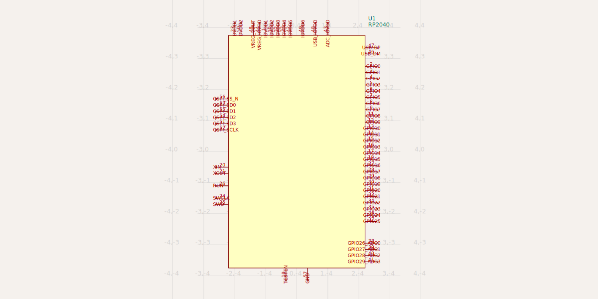
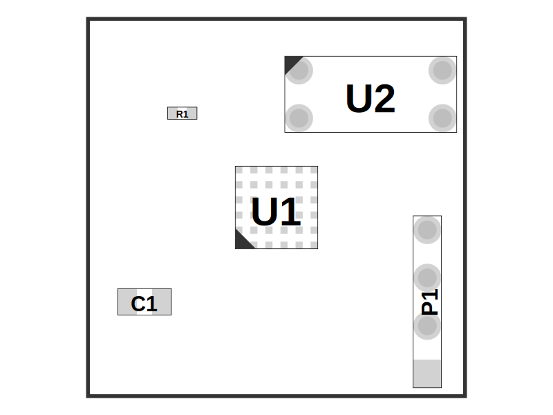
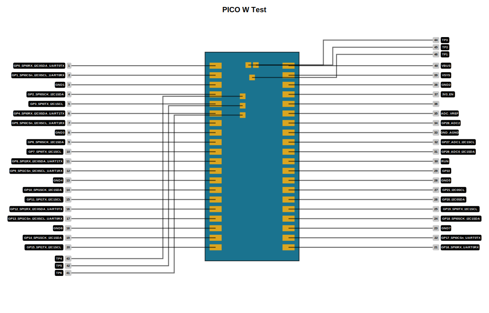
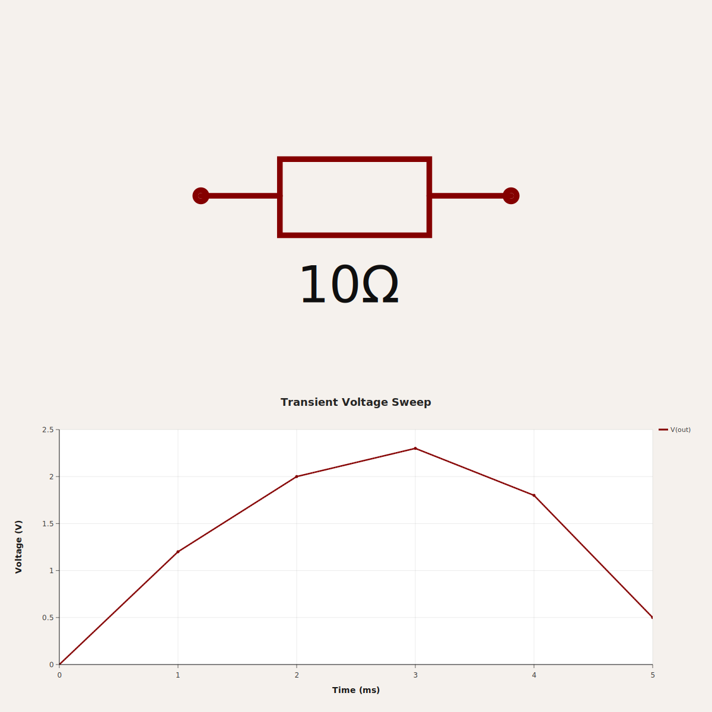
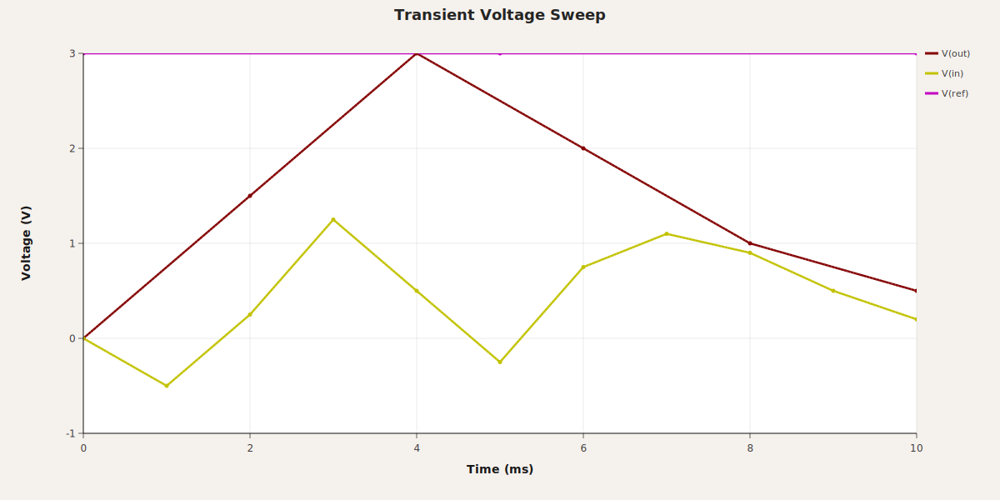

# circuit-to-svg

A TypeScript library for converting Circuit JSON to Schematic, PCB and Assembly SVG representations.

[Getting Started Contributor Video](https://share.cleanshot.com/6zXbLGF7)

<div align="center">
  
  
</div>

```bash
npm add circuit-to-svg
# or...
bun add circuit-to-svg
```

## Overview

This library provides functionality to convert Circuit JSON into SVG (Scalable Vector Graphics) representations. It supports both schematic and PCB (Printed Circuit Board), and Assembly layouts.

## Installation

```bash
npm install circuit-to-svg
```

## Usage

```typescript
import { readFileSync, writeFileSync } from 'fs'
import { convertCircuitJsonToSchematicSvg } from 'circuit-to-svg'

const circuitJson = JSON.parse(readFileSync('circuit.json', 'utf8'))
const schematicSvg = convertCircuitJsonToSchematicSvg(circuitJson)

writeFileSync('schematic.svg', schematicSvg)
```

Explore the API sections below to render PCB, assembly, pinout, simulation, and solder paste views.

| Function | Description |
| --- | --- |
| [`convertCircuitJsonToSchematicSvg`](#convertcircuitjsontoschematicsvg) | Generate schematic SVG output from Circuit JSON. |
| [`convertCircuitJsonToSchematicSimulationSvg`](#convertcircuitjsontoschematicsimulationsvg) | Overlay simulation data on schematic diagrams. |
| [`convertCircuitJsonToPcbSvg`](#convertcircuitjsontopcbsvg) | Render PCB layouts as SVG graphics. |
| [`convertCircuitJsonToSolderPasteMask`](#convertcircuitjsontosolderpastemask) | Create solder paste mask layers for fabrication. |
| [`convertCircuitJsonToAssemblySvg`](#convertcircuitjsontoassemblysvg) | Produce assembly view SVGs for board visualization. |
| [`convertCircuitJsonToPinoutSvg`](#convertcircuitjsontopinoutsvg) | Build annotated pinout diagrams for boards and modules. |
| [`convertCircuitJsonToSimulationGraphSvg`](#convertcircuitjsontosimulationgraphsvg) | Plot simulation experiment results as SVG graphs. |

## API

## convertCircuitJsonToSchematicSvg

`convertCircuitJsonToSchematicSvg(circuitJson: AnyCircuitElement[], options?): string`

Converts a schematic circuit description to an SVG string.

```typescript
import { convertCircuitJsonToSchematicSvg } from 'circuit-to-svg'

const schematicSvg = convertCircuitJsonToSchematicSvg(circuitJson, {
  includeVersion: true,
})
```



### Options

- `width` and `height` – dimensions of the output SVG. Defaults to `1200x600`.
- `grid` – enable a schematic grid (`true`) or configure cell size and labels.
- `labeledPoints` – annotate specific coordinates with helper labels.
- `colorOverrides` – override portions of the schematic color palette.
- `includeVersion` – if `true`, add a `data-circuit-to-svg-version` attribute to
  the root `<svg>`.

## convertCircuitJsonToPcbSvg

`convertCircuitJsonToPcbSvg(circuitJson: AnyCircuitElement[], options?): string`

Converts a PCB layout description to an SVG string.

```typescript
import { convertCircuitJsonToPcbSvg } from 'circuit-to-svg'

const pcbSvg = convertCircuitJsonToPcbSvg(circuitJson, {
  matchBoardAspectRatio: true,
  backgroundColor: '#1e1e1e',
})
```


### Options

- `width` and `height` – dimensions of the output SVG. Defaults to `800x600`.
- `matchBoardAspectRatio` – if `true`, adjust the SVG dimensions so the
  resulting aspect ratio matches the `pcb_board` found in the circuit JSON.
- `backgroundColor` – fill color for the SVG background rectangle. Defaults to
  `"#000"`.
- `drawPaddingOutsideBoard` – if `false`, omit the board outline and extra
  padding around it. Defaults to `true`.
- `shouldDrawErrors` – if `true`, display visual error indicators (red diamonds with text) for error elements in the circuit JSON. Supports:
  - `pcb_trace_error` – errors related to PCB traces
  - `pcb_footprint_overlap_error` – errors for overlapping pads, plated holes, and holes (displays error indicators at each affected element with connecting lines)
  
  Defaults to `false`.
- `includeVersion` – if `true`, add a `data-circuit-to-svg-version` attribute to
  the root `<svg>`.

## convertCircuitJsonToAssemblySvg

Converts circuit JSON into an assembly view of the board and components.

```typescript
import { convertCircuitJsonToAssemblySvg } from 'circuit-to-svg'

const assemblySvg = convertCircuitJsonToAssemblySvg(circuitJson, {
  includeVersion: false,
})
```



### Options

- `width` and `height` – dimensions of the output SVG. Defaults to `800x600`.
- `includeVersion` – if `true`, add a `data-circuit-to-svg-version` attribute to
  the root `<svg>`.

## convertCircuitJsonToPinoutSvg

Generates pinout diagrams that call out ports, pads, and holes for boards or modules.

```typescript
import { convertCircuitJsonToPinoutSvg } from 'circuit-to-svg'

const pinoutSvg = convertCircuitJsonToPinoutSvg(circuitJson)
```



### Options

- `width` and `height` – dimensions of the output SVG. Defaults to `800x600`.
- `includeVersion` – if `true`, add a `data-circuit-to-svg-version` attribute to
  the root `<svg>`.

## convertCircuitJsonToSchematicSimulationSvg

Overlays simulation results directly on the rendered schematic for easy debugging.

```typescript
import { convertCircuitJsonToSchematicSimulationSvg } from 'circuit-to-svg'

const schematicSimulationSvg = convertCircuitJsonToSchematicSimulationSvg({
  circuitJson,
  simulation_experiment_id: 'simulation-experiment-id',
  simulation_transient_voltage_graph_ids: ['transient-graph-id'],
  schematicHeightRatio: 0.6,
})
```



### Options

- `width` and `height` – overall SVG dimensions. Defaults to `1200x1200`.
- `schematicHeightRatio` – ratio of the SVG dedicated to the schematic view. Defaults to `0.55`.
- `schematicOptions` – forward additional schematic rendering options (except `width`, `height`, and `includeVersion`).
- `includeVersion` – if `true`, add a `data-circuit-to-svg-version` attribute to
  the root `<svg>`.
- `graphAboveSchematic` – if `true`, place the simulation graph above the
  schematic instead of below (defaults to `false`).

## convertCircuitJsonToSimulationGraphSvg

Creates standalone graphs for circuit simulation experiments.

```typescript
import { convertCircuitJsonToSimulationGraphSvg } from 'circuit-to-svg'

const simulationGraphSvg = convertCircuitJsonToSimulationGraphSvg({
  circuitJson,
  simulation_experiment_id: 'simulation-experiment-id',
  simulation_transient_voltage_graph_ids: ['transient-graph-id'],
})
```



### Options

- `width` and `height` – SVG dimensions for the graph. Defaults to `1200x600`.
- `includeVersion` – if `true`, add a `data-circuit-to-svg-version` attribute to
  the root `<svg>`.

## convertCircuitJsonToSolderPasteMask

`convertCircuitJsonToSolderPasteMask(circuitJson: AnyCircuitElement[], options: { layer: 'top' | 'bottom'; width?; height?; includeVersion? }): string`

Produces top and bottom solder paste mask renderings suitable for stencil generation.

```typescript
import { convertCircuitJsonToSolderPasteMask } from 'circuit-to-svg'

const solderPasteMaskSvg = convertCircuitJsonToSolderPasteMask(circuitJson, {
  layer: 'top',
})
```


### Options

- `layer` – `'top' | 'bottom'`, chooses which solder paste layer to render. Defaults to `'top'`.
- `width` and `height` – dimensions of the output SVG. Defaults to `800x600`.
- `includeVersion` – if `true`, add a `data-circuit-to-svg-version` attribute to
  the root `<svg>`.

